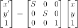

# Práctica 2: Transformaciones geométricas.

Integrantes:
- Gerardo León Quintana
- Susana Suárez Mendoza

# Instrucciines de uso OPTATIVO

## 1a. Desarrollar una aplicación que lleve a cabo transformaciones de la imagen en tiempo real a través de una interfaz basada en trackbars o equivalente.
Este programa permite realizar transformaciones en tiempo real sobre una imagen mediante una interfaz que utiliza barras deslizantes (trackbars). Las transformaciones disponibles incluyen traslaciones, rotaciones y escalados, tanto uniformes como no uniformes. La interfaz es intuitiva y permite al usuario ajustar parámetros dinámicamente para visualizar los cambios en la imagen al instante.
**Flujo del programa:**
1. **Cargar la imagen**
```python
img = cv.imread('./images/img_cuadro.jpg', cv.IMREAD_COLOR)
if img is None:
    raise FileNotFoundError("La imagen no se encontró en la ruta especificada.")
```
2. **Configuración de la interfaz**: Se crean varias barras deslizantes que permiten ajustar los parámetros de las transformaciones:
- Traslación: Magnitud de la traslación en los ejes X e Y.
- Rotación: Centro de giro y ángulo de rotación.
- Escalado: Factores de escala, tanto uniformes como no uniformes.
```python
cv.createTrackbar('X', 'image', 0, width, nothing)
cv.createTrackbar('Y', 'image', 0, height, nothing)
cv.createTrackbar('Angulo', 'image', 0, 360, nothing)
cv.createTrackbar('Escala', 'image', 50, 100, nothing)
cv.createTrackbar('Escala X', 'image', 50, 100, nothing)
cv.createTrackbar('Escala Y', 'image', 50, 100, nothing)
```
3. **Visualización de la imagen**: La imagen original se muestra en una ventana, y los cambios se aplican en tiempo real. Se alterna entre diferentes modos de transformación (traslación, rotación, escalado) al presionar la tecla 'm'.
```python
while True:
    key = cv.waitKey(1) & 0xFF
    if key == ord('m'):
      ...
```
4. **Aplicación de transformaciones**: Dependiendo del modo seleccionado, se aplican las transformaciones correspondientes a la imagen.
- **Traslaciones**: La transformación de traslación permite desplazar la imagen en las direcciones de los ejes X e Y. El usuario tiene la capacidad de especificar la magnitud de la traslación mediante el uso de `trackbars`, los cuales ajustan la posición de la imagen. Esta operación se realiza aplicando la siguiente fórmula, donde OpenCV efectúa la transformación de manera directa:

<p align="center">

</p>

```python
while True:
  ...
  if mode == 'Traslación':
        T = np.float32([[1, 0, tx], [0, 1, ty]])
        img_display = cv.warpAffine(img_display, T, size)
        texto = f'Modo: Traslacion'
  ...
```
- **Rotaciones**: La transformación de rotación permite rotar una imagen alrededor de un centro de giro, el cual se determina al pulsar el botón izquierdo del ratón. Los grados de rotación se pueden ajustar mediante un `trackbar`. Esta operación se realiza aplicando la siguiente fórmula, donde OpenCV lleva a cabo la transformación de manera directa:

<p align="center">

</p>

```python
def get_center(event, x, y, flags, param):
    global center, show_text, text_start_time
    if event == cv.EVENT_LBUTTONDOWN:
        center = (x, y)
    elif event == cv.EVENT_LBUTTONUP:
        return center
cv.setMouseCallback('image', get_center)
while True:
  ...
  elif mode == 'Rotación':
        R = cv.getRotationMatrix2D(center, angle, 1)
        img_display = cv.warpAffine(img_display, R, size)
        texto = f'Modo: Rotacion'
  ...
```
- **Escalados uniformes**: Los escalados uniformes son transformaciones que modifican el tamaño de una imagen de manera proporcional en todas las direcciones. Para llevar a cabo esta transformación, se requieren un único factor de escalado, `escala`, que son ajustados mediante un `trackbar`. Es importante destacar que el `trackbar` se mueven en un rango de 0 a 100, lo que se traduce en un escalado negativo entre 0 y 50 y un escalado positivo entre 50 y 100. La operación se realiza utilizando la siguiente fórmula:

<p align="center">

</p>

```python
cv.createTrackbar('Escala', 'image', 50, 100, nothing)
while True:
  ...
  elif mode == 'Escalado Uniforme':
        scale_factor = escala / 50.0  
        S = cv.getRotationMatrix2D(center, 0, scale_factor)
        img_display = cv.warpAffine(img_display, S, size)
        texto = f'Modo: Escalado Uniforme'
  ...
```
- **Escalados no uniformes**: 
Los escalados no uniformes son transformaciones que modifican el tamaño de una imagen de manera diferente en las direcciones de los ejes X e Y. A diferencia del escalado uniforme, que mantiene la relación de aspecto de la imagen, el escalado no uniforme puede distorsionar la imagen al aplicar factores de escalado distintos para cada dirección.

<p align="center">

</p>

Donde:
- $S_x$: Factor de escalado en el eje X.
- $S_y$: Factor de escalado en el eje Y.
- $t_x$ y $t_y$ son los desplazamientos en las direcciones X e Y,  que se calculan con la fórmula $(1- S_x) ^* center[0]$ y $(1- S_y) ^* center[1]$ respectivamente. Esto centra el escalado alrededor de un punto específico, dado por `center`, que es un par de coordenadas (x, y) que representa el punto de origen para el escalado.

```python
while True:
  ...
  elif mode == 'Escalado No Uniforme':
          scale_x_factor = escala_x / 50.0  
          scale_y_factor = escala_y / 50.0
  
          S = np.float32([[scale_x_factor, 0, (1 - scale_x_factor) * center[0]],
                          [0, scale_y_factor, (1 - scale_y_factor) * center[1]]])
          img_display = cv.warpAffine(img_display, S, size)
          texto = f'Modo: Escalado No Uniforme'
```

## 1b. Dada una imagen trazar una ventana de proyección y proyectar la imagen.
Este programa permite seleccionar una región de interés en una imagen y proyectarla utilizando una transformación de perspectiva. El usuario puede especificar los puntos de la ventana de proyección directamente en la imagen mediante clics con el ratón, y el programa calculará y mostrará la imagen transformada en base a esos puntos.

1. **Inicialización de variables**: Se definen listas para almacenar los puntos seleccionados (`points`) y las acciones previas (`actions`). Además, se obtiene el ancho (`w`) y la altura (`h`) de la imagen para establecer el tamaño de la proyección.
2. **Función para guardar puntos**: Se define una función que maneja los eventos del ratón para registrar los puntos seleccionados por el usuario. Al hacer clic, se agregan las coordenadas a la lista de puntos, y al soltar el botón, se dibuja un círculo en la posición seleccionada.
```python
def save_point(event, x, y, flags, param):
    global points
    if event == cv.EVENT_LBUTTONDOWN:
        points.append([x, y])
    elif event == cv.EVENT_LBUTTONUP:
        cv.circle(img, (x, y), 5, (0, 0, 255), -1)
        actions.append(img.copy())
        cv.imshow('image', img)
```
3. **Proyección de la imagen**: Cuando se han seleccionado cuatro puntos, se procede a calcular la transformación de perspectiva y a proyectar la imagen original. Adicionalmente, se dibuja un polígono verde alrededor de la región seleccionada en la imagen original. Para aplicar esta transformación, es necesario obtener primero la matriz de proyección utilizando la función `cv.getPerspectiveTransform`, a la cual se le suministran los puntos correspondientes de la imagen original y los puntos de destino a los que se desea proyectar. Esta transformación se aplica a la imagen mediante la función `cv.warpPerspective`.

<p align="center">

</p>

```python
while True:
    ...
    if len(points) == 4:
        pts2 = np.float32([points[0], points[1], points[2], points[3]])
        
        Tp = cv.getPerspectiveTransform(pts1, pts2)
        img_p = cv.warpPerspective(img_orig, Tp, size)

        pts = pts2.astype(np.int32)
        pts = pts.reshape((-1,1,2))
        cv.polylines(img, [pts], True, (0, 255, 0), 2)
        cv.imshow('image', img_p)
```
4. **Funciones adicionales**: Se implementan opciones para limpiar la selección (`d`), deshacer la última acción (`r`), y salir del programa (`q`). Esto permite al usuario gestionar su interacción de manera flexible.
```python
    if key == ord('q'):
        break
    elif key == ord('d'):
        points = []
        actions = []
        cv.imshow('image', img)
    elif key == ord('r') and len(actions) != 0:
        points.pop()
        actions.pop()
        img = actions[-1].copy()
        cv.imshow('image', img)
```
## 1c. Desarrollar una aplicación que lleve a cabo distorsiones de la lente. Para ello los coeficientes de distorsión deben gobernarse a través de una interfaz.
Este programa permite aplicar distorsiones de lente a una imagen, utilizando dos coeficientes de distorsión (`K1` y `K2`) que pueden ser ajustados a través de una interfaz con barras deslizantes (`trackbars`). El usuario puede modificar estos valores en tiempo real, visualizando los efectos de la distorsión en la imagen.
1. **Definir la función de distorsión**: La función `apply_distortion` aplica la distorsión a la imagen utilizando los coeficientes `K1` y `K2`, que definen la intensidad de la distorsión.
   
<p align="center">

</p>

 Donde:
   - $ r $ es la distancia radial desde el centro de la imagen (el punto de origen de las distorsiones).
   - $ k_1 $, $ k_2 $, y $ k_3 $ son los coeficientes de distorsión radial.

Esta distorsión se clasifica principalmente en dos tipos:
- Distorsión en barril (Barrel Distortion): Ocurre cuando las líneas rectas en los bordes de la imagen parecen curvarse hacia adentro, como si estuvieran envolviendo un barril. $k_1 < 0 $, la imagen se curva hacia adentro.
- Distorsión en cojín (Pincushion Distortion): Ocurre cuando las líneas rectas en los bordes de la imagen parecen curvarse hacia afuera, dando una apariencia similar a un cojín de alfileres. $k_1 > 0 $, la imagen se curva hacia afuera.
```python
def apply_distortion(image, k1, k2):
    h, w = image.shape[:2]
    distCoeff = np.zeros((4,1), np.float64)
    distCoeff[0,0] = k1
    distCoeff[1,0] = k2

    cam = np.eye(3, dtype=np.float32)
    cam[0,2] = w/2.0 
    cam[1,2] = h/2.0
    cam[0,0] = 10.
    cam[1,1] = 10.

    distorted_img = cv.undistort(image, cam, distCoeff)
    return distorted_img
```
2. **Función de actualización** de la imagen La función `update_image` se encarga de leer los valores de las barras deslizantes y aplicar la distorsión a la imagen. Dependiendo de los valores de `K1` y `K2`, se actualiza la imagen mostrada.
```python
def update_image(val):
    global image
    k1 = (cv.getTrackbarPos('K1', 'DistLente') - 100) / 100000.0
    k2 = (cv.getTrackbarPos('K2', 'DistLente') - 100) / 100000.0

    if k1 != 0 or k2 != 0:
        distorted_img = apply_distortion(image, k1, k2)
        return distorted_img
    else:
        return image
```
3. **Visualización de la imagen**: El programa entra en un bucle donde se actualiza continuamente la imagen en función de los valores de las barras deslizantes. Pulsando la tecla 'd' se restablece la imagen original y la tecla 'Esc' cierra la ventana.

## 2a. Marcar el punto de giro con el ratón.
En esta sección, la única modificación respecto al apartado 1a es la incorporación de un círculo que se dibuja cuando se hace *click* con el ratón en el modo de rotación. Al detectar el evento de selección del punto de giro, se utiliza la función `cv.circle` para pintar un círculo en las coordenadas seleccionadas. Este círculo representa visualmente el centro de rotación de la imagen.
```python
def get_center(event, x, y, flags, param):
    ...
        if mode == 'Rotación':
            cv.circle(img, (center[0], center[1]), 5, (0, 0, 255), -1)
        return center
```

## 2b. Trasladar la imagen arrastrándolo con el ratón y visualizarlo en tiempo real.

En este apartado, a diferencia del apartado 1a, se implementa la funcionalidad de mover la imagen arrastrándola con el ratón. Para ello, se ha definido una variable `dragging`, la cual se activa cuando se encuentra en el modo de traslación. Mientras se detecta el movimiento del ratón mediante el evento `cv.EVENT_MOUSEMOVE`, se actualiza el nuevo centro de traslación de la imagen, permitiendo que esta se desplace en tiempo real conforme se arrastra el ratón.

```python
def get_center(event, x, y, flags, param):
    global center, show_text, text_start_time, dragging, prev_mouse_pos
    if event == cv.EVENT_LBUTTONDOWN:
        center = (x, y)
        if mode == 'Traslación':
            dragging = True
    elif event == cv.EVENT_MOUSEMOVE and dragging:
        dx = x - prev_mouse_pos[0]
        dy = y - prev_mouse_pos[1]
        center = (center[0] + dx, center[1] + dy)
        prev_mouse_pos = (x, y)

    elif event == cv.EVENT_LBUTTONUP:
        dragging = False
        return center
```

## 2c. Hacer la parte obligatoria sobre vídeo en lugar de sobre imagen.
En este apartado, el procedimiento es similar al de la parte obligatoria que utiliza imágenes, con la diferencia de que se emplea un flujo de vídeo capturado desde la cámara web del dispositivo en el que se está ejecutando el programa. Las transformaciones se aplican a cada uno de los fotogramas del vídeo en tiempo real.

```python
video = cv.VideoCapture(0)
_, frame = video.read()
...
while True:
    _, frame = video.read()
    ...
video.release()
```

## 2d. Dada una imagen seleccionar tres puntos de la imagen original y tres puntos en una imagen destino y realizar la transformación afín

Este programa permite aplicar una transformación afín a una imagen mediante la selección interactiva de tres puntos en la imagen original y tres puntos correspondientes en una imagen de destino. La transformación afín preserva la colinealidad de los puntos y las proporciones entre distancias a lo largo de las líneas paralelas, aunque no necesariamente mantiene las distancias y ángulos originales. El proceso se lleva a cabo de manera interactiva utilizando el ratón para seleccionar los puntos en la imagen.

La fórmula general de la transformación afín está dada por:

<p align="center">

</p>

1. **Seleccionar puntos en la imagen**: El usuario puede hacer clic con el ratón sobre la imagen para seleccionar tres puntos en la imagen original. Luego, se seleccionan tres puntos en la imagen destino que representarán los puntos a los cuales se va a mapear la imagen original. Los puntos seleccionados se muestran en la imagen con pequeños círculos.

```python
def select_points(event, x, y, flags, param):
    if event == cv.EVENT_LBUTTONDOWN:
        if len(points_orig) < 3:
            points_orig.append([x, y])
            cv.circle(img, (x, y), 5, (0, 0, 255), -1)
        elif len(points_orig) == 3 and len(points_dest) < 3:
            points_dest.append([x, y])
            cv.circle(img, (x, y), 5, (255, 0, 0), -1)
```
2. **Aplicar la transformación afín**: Una vez seleccionados los tres puntos en ambas imágenes, se calcula la matriz de transformación afín utilizando la función `cv.getAffineTransform`. Esta matriz se utiliza para transformar la imagen original, ajustándola a los puntos seleccionados en la imagen destino.

```python
def apply_affine_transform(img, points_orig, points_dest):
    pts1 = np.float32(points_orig)
    pts2 = np.float32(points_dest)
    M = cv.getAffineTransform(pts1, pts2)
    img_transformed = cv.warpAffine(img, M, size)
    return img_transformed
...
while True:
    ...
    if len(points_orig) == 3 and len(points_dest) == 3:
        img = apply_affine_transform(img_copy, points_orig, points_dest)
        img_copy = img.copy()
        points_orig = []
        points_dest = []
```


## FINAL
- problemas en lo de girar
